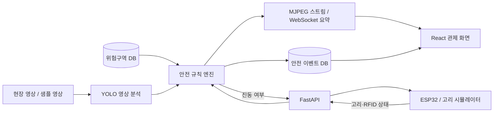

# AI 안전관리 플랫폼

건설·산업 현장의 작업자와 보호구 상태를 영상으로 분석하고, 위험구역 진입 및 안전고리 체결 상태를 함께 판단하는 실시간 안전 관제 프로토타입입니다.

YOLO 기반 사람·안전모 감지, 위험구역 폴리곤 판정, ESP32 안전고리 연동을 하나의 분석 파이프라인으로 결합합니다. 분석 영상과 작업자별 상태는 웹 관제 화면에 실시간으로 표시되며, 긴급 이벤트는 SQLite에 기록됩니다.

## 주요 기능

- YOLO 모델을 이용한 사람 및 안전모 감지
- 작업자 발 위치와 정규화된 위험구역 폴리곤 비교
- 안전모·안전고리·구역 상태를 조합한 `ok` / `warn` / `alert` 판정
- 분석 결과가 표시된 MJPEG 영상 실시간 스트리밍
- WebSocket 기반 작업 인원, 보호구 위반, 처리 FPS 실시간 전송
- 안전 이벤트 저장·조회·조치 완료 처리
- RFID 승인 여부를 포함한 안전고리 상태 수신 및 진동 명령 응답
- 샘플 영상 반복 재생과 안전고리 장치 시뮬레이터 제공

## 시스템 구성



| 영역 | 기술 |
|---|---|
| 프런트엔드 | React 19, Vite 8, Tailwind CSS 4 |
| 백엔드 | Python, FastAPI, Uvicorn, WebSocket |
| AI·영상 | Ultralytics YOLO, OpenCV, Pillow |
| 공간 판정 | Shapely |
| 데이터 | SQLAlchemy, SQLite |
| 장치 연동 | HTTP REST, ESP32 안전고리 시뮬레이터 |

## 빠른 시작

### 1. 사전 요구사항

- Windows 및 PowerShell
- Python 3.10 이상
- Node.js 20 이상 및 npm

현재 영상 한글 오버레이가 Windows의 `맑은 고딕` 글꼴 경로를 사용하고, 통합 실행 스크립트도 PowerShell용으로 작성되어 있습니다. YOLO 가중치와 샘플 영상은 저장소에 포함되어 있습니다.

### 2. 의존성 설치

프로젝트 루트에서 다음 명령을 실행합니다.

```powershell
python -m venv .venv
.\.venv\Scripts\Activate.ps1
python -m pip install -r .\backend\requirements.txt
npm --prefix .\frontend install
```

### 3. 통합 실행

AI 영상 분석과 안전고리 시뮬레이터를 포함해 실행하려면 다음 명령을 사용합니다.

```powershell
.\start.ps1 -WithAnalyzer -WithHarness
```

실행 후 접속 주소는 다음과 같습니다.

| 서비스 | 주소 |
|---|---|
| 관제 화면 | http://localhost:5173 |
| 백엔드 API | http://localhost:8000 |
| Swagger API 문서 | http://localhost:8000/docs |
| 상태 확인 | http://localhost:8000/health |

`start.ps1`을 실행한 터미널에서 Enter를 누르면 스크립트가 시작한 프로세스가 함께 종료됩니다.

### 실행 옵션

| 명령 | 동작 |
|---|---|
| `.\start.ps1` | 백엔드와 프런트엔드만 실행 |
| `.\start.ps1 -WithAnalyzer` | 샘플 영상을 사용하는 통합 AI 분석 포함 |
| `.\start.ps1 -WithHarness` | 안전고리 시뮬레이터 포함 |
| `.\start.ps1 -WithAnalyzer -WithHarness` | 전체 데모 실행 |

분석을 활성화하지 않으면 API와 관제 화면은 실행되지만 영상 분석 상태는 `stopped`로 유지됩니다.

## 데모 사용법

전체 데모를 실행하면 안전고리 시뮬레이터 창에서 아래 키를 입력할 수 있습니다.

| 입력 | 시뮬레이션 상태 |
|---|---|
| `o` | 고리 열림 |
| `c` | 승인 RFID 지점에 정상 체결 |
| `x` | 미승인 RFID 지점에 체결 |
| `q` | 시뮬레이터 종료 |

고리가 닫혀 있어도 RFID 태그가 승인 목록에 없으면 미체결로 판정됩니다. 장치 상태가 5초 이상 갱신되지 않아도 오프라인·미체결로 처리합니다.

## 개별 실행

환경별 설정이 필요하면 루트의 `.env.example`을 `.env`로 복사한 뒤 값을 변경합니다. `.env`는 Git에서 제외되며, 백엔드·프런트엔드·`start.ps1`이 모두 이 파일을 사용합니다.

```powershell
Copy-Item .env.example .env
```

통합 스크립트 대신 각 구성 요소를 별도로 실행할 수도 있습니다.

```powershell
# 터미널 1: 백엔드와 통합 분석
Set-Location .\backend
$env:ANALYSIS_ENABLED = "1"
python -m uvicorn app.main:app --host 127.0.0.1 --port 8000 --reload

# 터미널 2: 프런트엔드
Set-Location .\frontend
npm run dev

# 터미널 3: 안전고리 시뮬레이터(선택)
Set-Location .\backend
python -m scripts.harness_sim
```

기본 입력 영상은 `data/videos/site1.mp4`입니다. 다른 영상 파일을 사용하려면 백엔드 실행 전에 절대 경로나 프로젝트 루트 기준 상대 경로를 지정합니다.

```powershell
$env:VIDEO_SOURCE = "data/videos/my-site.mp4"
```

## 주요 API

| 방식 | 경로 | 설명 |
|---|---|---|
| `GET` | `/health` | 서버 상태 확인 |
| `GET` | `/api/analysis/status` | 최신 분석 상태 조회 |
| `GET` | `/api/analysis/stream` | 분석 영상 MJPEG 스트림 |
| `WS` | `/ws` | 관제 요약 및 작업자 상태 실시간 수신 |
| `GET` | `/api/events` | 최근 안전 이벤트 조회 |
| `POST` | `/api/events/{event_id}/resolve` | 이벤트 조치 완료 처리 |
| `GET` | `/api/events/stats/summary` | 이벤트 유형별 통계 |
| `GET` / `POST` | `/api/zones` | 위험구역 조회·등록 |
| `GET` / `POST` | `/api/harness/state` | 안전고리 상태 조회·전송 |

위험구역은 영상 너비와 높이를 각각 `0.0~1.0`으로 환산한 좌표 배열로 등록합니다. 지원 구역 유형은 `no_entry`, `fall_risk`, `heavy_equip`입니다.

```powershell
$body = @{
    name = "2층 추락위험구역"
    zone_type = "fall_risk"
    polygon = @(@(0.30, 0.40), @(0.70, 0.40), @(0.70, 0.95), @(0.30, 0.95))
} | ConvertTo-Json

Invoke-RestMethod -Method Post `
    -Uri "http://localhost:8000/api/zones" `
    -ContentType "application/json" `
    -Body $body
```

새로 등록한 구역은 분석 서비스가 시작될 때 로드되므로, 실행 중 추가했다면 백엔드를 재시작해야 분석 영상에 반영됩니다.

## 프로젝트 구조

```text
safety-platform/
├─ start.ps1                  # 백엔드·프런트엔드·시뮬레이터 통합 실행
├─ data/videos/site1.mp4      # 기본 분석 영상
├─ docs/
│  ├─ project-overview.md     # 목적, 구조, 데이터 흐름, 현재 제약
│  └─ project-devices.md      # 안전 장치 구성 문서
├─ backend/
│  ├─ app/
│  │  ├─ main.py              # FastAPI 진입점
│  │  ├─ routers/             # analysis, events, zones, harness API
│  │  └─ services/            # 감지, 분석, 규칙, 오버레이, 장치 상태
│  ├─ scripts/                # 오프라인 분석 및 장치 시뮬레이터
│  ├─ weights/best.pt         # 안전모 감지 모델
│  ├─ yolov8n.pt              # 사람 감지 모델
│  └─ safety.db               # 위험구역 및 이벤트 SQLite DB
└─ frontend/
   └─ src/App.jsx             # 실시간 안전 관제 화면
```

## 검증 명령

```powershell
npm --prefix .\frontend run lint
npm --prefix .\frontend run build
python -m compileall .\backend\app .\backend\scripts
```

오프라인 영상 분석 결과를 파일로 만들려면 `backend` 폴더에서 다음 명령을 실행합니다.

```powershell
python -m scripts.analyze_video ..\data\videos\site1.mp4
python -m scripts.analyze_video2 ..\data\videos\site1.mp4
```

각 결과는 기본적으로 `backend/output.mp4`, `backend/output2.mp4`에 저장됩니다. 두 번째 스크립트는 구역과 안전고리 상태를 함께 사용하므로 백엔드가 실행 중이어야 합니다.

## 현재 구현 범위

이 저장소는 단일 영상과 단일 안전고리 장치(`worker-1`)를 중심으로 한 데모 프로토타입입니다. 작업자 추적 ID는 프레임별 감지 순서에 따라 부여되며, 모든 감지 작업자에게 같은 고리 상태가 적용됩니다. 카메라·장치 다중화, 사용자 인증, 이벤트 스냅샷 저장, 구역 실시간 재로딩, 운영 환경 배포 설정은 아직 포함되어 있지 않습니다.

상세한 프로젝트 목적과 판정 흐름은 [프로젝트 개요](docs/project-overview.md), 장치 구성은 [프로젝트 장치 문서](docs/project-devices.md)를 참고하세요.
