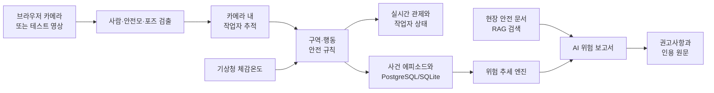

# AI 현장 안전관리 플랫폼

> 브라우저 카메라 또는 테스트 영상을 실시간 분석해 작업자를 추적하고, 안전모·위험구역·이상행동·폭염 위험을 하나의 관제 화면에서 관리하는 FastAPI + React 기반 안전 운영 플랫폼입니다.

이 프로젝트의 핵심은 단순 객체 검출이 아니라 **사람·장소·시간의 맥락을 함께 판단하는 것**입니다. 예를 들어 일반구역의 안전모 미착용은 사건으로 저장하지 않지만, 작업구역 안에서 같은 상황이 발생하면 작업자별 위험 사건으로 기록합니다. 연속 프레임의 같은 위험은 한 개의 사건 에피소드로 묶고, 누적 데이터는 위험 추세와 근거 문서가 포함된 AI 보고서로 연결됩니다.

## 한눈에 보기

| 영역 | 제공 기능 |
|---|---|
| 영상 입력 | 브라우저 카메라 또는 로컬 테스트 영상, 현장별 활성 입력 1개 |
| AI 분석 | 사람·안전모 검출, 포즈 기반 행동 분류, 외형 특징을 활용한 카메라 내 추적 |
| 안전 규칙 | 작업구역 안전모 미착용, 출입금지·추락위험·중장비 구역 접근/진입 |
| 폭염 안전 | 기상청 API 기반 체감온도, 폭염 맥락 행동 이벤트, 노출 시간·휴식 권고 |
| 관제 | 실시간 오버레이, 작업자 카드, 이벤트 로그, 사건 해결 처리 |
| 위험 분석 | 단기/장기 추세, 결정론적 위험 점수, 사건 목록, AI 위험 보고서 |
| 지식 검색 | 안전 문서 업로드, 임베딩 검색, 보고서 인용 원문 확인 |
| 운영 | 다중 현장, 회사·현장·구역 안전 순위, 플랫폼 관리자 화면 |
| 배포 | JupyterHub 팀 컨테이너, FastAPI 단일 origin, Cloudflare Tunnel HTTPS |

## 판단 흐름



### 맥락 기반 사건 정책

| 상황 | 화면 판정 | 사건 저장 |
|---|---|---|
| 일반구역에서 안전모 미착용 | 상태는 표시 가능 | 저장하지 않음 |
| 작업구역 안에서 안전모 미착용 | 경고 | `no_helmet` |
| 출입금지구역 경계 근처 | 접근 경고 | `zone_approach` |
| 출입금지구역 내부 진입 | 위험 알림 | `zone_intrusion` |
| 주저앉음·쓰러짐·장시간 정지 | 행동 상태 표시 | `sudden_sit`, `fall`, `fall_still` |
| 폭염 맥락에서 같은 이상행동 | 폭염 위험으로 구분 | `heat_*` 이벤트 |

같은 작업자가 같은 위험을 여러 프레임 동안 연속 발생시켜도 평가와 위험 추세에서는 프레임 수가 아니라 **사람별 사건 에피소드 1건**으로 취급합니다.

## 기술 스택

| 계층 | 기술 |
|---|---|
| Frontend | React 19, Vite 8, Tailwind CSS 4, Recharts |
| API / 실시간 | FastAPI, Uvicorn, WebSocket |
| 비전 | Ultralytics YOLO, OpenCV, PyTorch, TorchVision |
| 추적 | 카메라 내 로컬 추적, HSV/Lab 외형 특징 |
| 공간 판정 | Shapely, 정규화 폴리곤 ROI |
| 데이터 | SQLAlchemy, SQLite 또는 PostgreSQL/Supabase, pgvector |
| AI 보고서 | OpenAI Python SDK, 구조화 출력, 결정론적 fallback 보고서 |
| RAG | OpenAI Embeddings 또는 로컬 `BAAI/bge-m3`, 문서 chunk 검색, PDF/TXT/MD |
| 외부 데이터 | 기상청 단기예보 API |
| 배포 | JupyterHub, Cloudflare Tunnel, 동일 origin 정적 배포 |

## 빠른 시작

### 요구 사항

- Python 3.11 이상
- Node.js 20 이상과 npm
- Git
- AI 분석을 사용할 경우 사람·안전모·포즈 모델 파일
- 선택 사항: PostgreSQL/Supabase, OpenAI API 키, 기상청 API 키

### Linux / macOS 개발 환경

```bash
git clone <REPOSITORY_URL> safety-platform
cd safety-platform

cp .env.example .env
chmod 600 .env

python3 -m venv backend/.venv
backend/.venv/bin/python -m pip install --upgrade pip
backend/.venv/bin/python -m pip install -r backend/requirements.txt

cd frontend
npm ci
cd ..

./start.sh
```

AI 분석까지 시작하려면 모델 경로를 확인한 뒤 다음 명령을 사용합니다.

```bash
./start.sh --with-analyzer
```

기본 접속 주소는 다음과 같습니다.

- 개발 화면: `http://localhost:5173`
- API 문서: `http://localhost:8000/docs`
- 상태 확인: `http://localhost:8000/health`

`Ctrl+C`를 누르면 개발용 백엔드와 프런트엔드가 함께 종료됩니다.

### Windows PowerShell

```powershell
git clone <REPOSITORY_URL> safety-platform
cd safety-platform
Copy-Item .env.example .env

py -3.11 -m venv backend\.venv
backend\.venv\Scripts\python -m pip install --upgrade pip
backend\.venv\Scripts\python -m pip install -r backend\requirements.txt

cd frontend
npm install
cd ..

.\start.ps1
```

AI 분석 포함 실행은 다음과 같습니다.

```powershell
.\start.ps1 -WithAnalyzer
```

## 모델 준비

기본 모델 경로는 백엔드 실행 디렉터리인 `backend/`를 기준으로 해석됩니다.

| 용도 | 기본 경로 | 필수 여부 |
|---|---|---|
| 안전모 검출 | `backend/weights/best.pt` | 안전모 기능에 필요 |
| 사람 검출 | `backend/yolov8n.pt` | 사람 분석에 필요 |
| 포즈 분석 | `backend/weights/yolo11n-pose.pt` | `POSE_ENABLED=1`일 때 필요 |

모델과 가중치는 대용량 파일이므로 Git에서 제외됩니다. 팀이 학습하거나 승인받은 파일을 각 경로에 별도로 배치하세요.

## 처음 사용하는 순서

1. 첫 화면에서 회사명·담당자명·첫 현장명을 입력해 계정을 만듭니다.
2. 현장 설정에서 실내/실외와 위치 정보를 확인합니다. 실외 현장은 기상청 체감온도 계산에 좌표를 사용합니다.
3. 브라우저 카메라나 테스트 영상 중 하나를 활성 입력으로 연결합니다.
4. 구역 편집기에서 작업구역, 출입금지, 추락위험 또는 중장비 작업반경을 그립니다.
5. 관제 화면에서 작업자 ID, 안전모, 행동, 폭염 노출과 이벤트 로그를 확인합니다.
6. 위험 추세 분석에서 사건 에피소드와 단기/장기 위험도를 확인합니다.
7. 안전 문서를 등록한 뒤 AI 보고서를 생성하고, 인용 번호를 눌러 실제 근거 원문을 확인합니다.

## 핵심 환경변수

루트 `.env`는 애플리케이션과 배포 스크립트가 함께 읽습니다. 실제 키와 비밀번호는 이 파일에만 저장하고 Git에 커밋하지 마세요.

| 변수 | 설명 | 기본/권장 값 |
|---|---|---|
| `ANALYSIS_ENABLED` | 서버 시작 시 파일 기반 분석 사용 | 개발 `0`, 분석 시 `1` |
| `VIDEO_SOURCE` | 기본 테스트 영상 | `data/videos/site1.mp4` |
| `POSE_ENABLED` | 포즈 기반 행동 감지 | 모델 준비 후 `1` |
| `DATABASE_URL` | SQLite 또는 PostgreSQL 연결 문자열 | `sqlite:///./safety.db` |
| `COOKIE_SECURE` | HTTPS 전용 로그인 쿠키 | 로컬 HTTP `0`, 외부 HTTPS `1` |
| `KMA_API_KEY` | 기상청 API 인증키 | 실외 체감온도 사용 시 설정 |
| `OPENAI_ENABLED` | OpenAI 보고서 및 `auto` 외부 임베딩 활성화 | 키 설정 후 `1` |
| `OPENAI_API_KEY` | OpenAI 또는 호환 gateway 키 | `.env`에만 저장 |
| `OPENAI_MODEL` | 보고서 생성 모델 | `gpt-4o-mini` |
| `OPENAI_BASE_URL` | 별도 호환 gateway 주소 | 없으면 공식 OpenAI API |
| `EMBEDDING_PROVIDER` | RAG 임베딩 제공자 | `auto`: OpenAI 활성 시 외부, 아니면 로컬 |
| `EMBEDDING_MODEL_NAME` | 로컬 RAG 임베딩 모델 | `BAAI/bge-m3` |
| `OPENAI_EMBEDDING_MODEL` | 외부 RAG 임베딩 모델 | `text-embedding-3-small` |
| `EMBEDDING_DIM` | 저장하는 임베딩 차원 | `1024` |
| `RAG_TOP_K` / `RAG_THRESHOLD` | 검색 개수와 최소 유사도 | `5` / `0.7` |
| `RISK_WINDOW_MODE` | 위험 추세 시간축 | 데모 `demo`, 운영 `production` |
| `CLOUDFLARE_TUNNEL_TOKEN` | 고정 named tunnel 토큰 | Quick Tunnel은 비워 둠 |
| `PUBLIC_URL` | named tunnel 공개 주소 | named tunnel 사용 시 설정 |

`EMBEDDING_PROVIDER=auto`는 `OPENAI_ENABLED=1`일 때 기존 `OPENAI_API_KEY`를
재사용하므로 별도 키 설정이 필요하지 않습니다. 임베딩 제공자나 모델을 바꾸면 기존
벡터와 혼용할 수 없으므로 저장된 안전 문서를 새 모델로 다시 인덱싱해야 합니다.

기상청에서 받은 인코딩 인증키에 `%`가 포함되어 있어도 `.env`에서는 별도 이스케이프 없이 발급값 그대로 입력합니다. 반면 `DATABASE_URL`의 비밀번호에 `@`, `/`, `#`, `%` 같은 예약 문자가 있으면 URL 인코딩된 연결 문자열을 사용하는 것이 안전합니다.

권장 파일 권한은 다음과 같습니다.

```bash
chmod 600 .env
```

### 위험 추세 시간축

데모 모드는 실제 사건의 최근 1분과 5분을 비교해 5초마다 갱신합니다. 기존 API 호환성을 위해 요청 파라미터는 `24h`, `7d`를 유지하지만 화면 라벨과 내부 계산 구간을 데모 시간축으로 매핑합니다.

```dotenv
RISK_WINDOW_MODE=demo
RISK_REFRESH_SECONDS=5
RISK_SHORT_WINDOW_MINUTES=1
RISK_LONG_WINDOW_MINUTES=5
```

실운영 시간축은 다음과 같습니다.

```dotenv
RISK_WINDOW_MODE=production
```

AI 보고서는 사용자가 생성 버튼을 눌렀을 때만 OpenAI를 호출합니다. OpenAI가 비활성화됐거나 호출에 실패해도 결정론적 Risk Engine 결과를 사용한 fallback 보고서가 반환됩니다.

## JupyterHub + Cloudflare 배포

학교 JupyterHub 팀 컨테이너에서는 FastAPI가 React production build까지 `127.0.0.1:8000`에서 제공합니다. `cloudflared`가 컨테이너에서 Cloudflare 엣지로 연결하므로 호스트 inbound 포트를 열지 않고 외부 HTTPS 주소를 만들 수 있습니다.

```text
심사자 브라우저
    │ HTTPS
    ▼
Cloudflare 글로벌 엣지
    ▲ outbound QUIC 또는 HTTP/2 over TCP 443
    │
팀 컨테이너: cloudflared → 127.0.0.1:8000 → FastAPI + React
```

최초 설치와 시작:

```bash
bash deploy/jupyterhub/install.sh
bash deploy/jupyterhub/service.sh start
```

운영 명령:

```bash
bash deploy/jupyterhub/service.sh status
bash deploy/jupyterhub/service.sh logs
bash deploy/jupyterhub/service.sh restart
bash deploy/jupyterhub/service.sh stop
```

코드 갱신:

```bash
bash deploy/jupyterhub/update.sh
```

`update.sh`는 tracked 파일에 로컬 수정이 있으면 안전하게 중단하고, 문제가 없을 때만 `git pull --ff-only` → 의존성 동기화 → 프런트엔드 빌드 → 서비스 재시작을 수행합니다.

Quick Tunnel은 시작할 때 `https://<random>.trycloudflare.com` 주소를 만들며 재시작할 때 URL이 바뀝니다. 데모 편의 기능일 뿐 가용성 보장이 없으므로 심사 직전에는 재시작하지 않는 것이 좋습니다. 고정 주소가 필요하면 Cloudflare named tunnel의 토큰과 `PUBLIC_URL`을 `.env`에 설정하세요.

자세한 운영 절차는 [JupyterHub 배포 가이드](docs/deployment-jupyterhub.md)를 참고하세요.

## 평가 데이터셋: 무엇을 평가하는가?

`evaluation/`은 모델이 단지 영상을 처리하는지가 아니라 **안전 규칙을 올바른 맥락에서 적용하는지** 반복 검증하기 위한 40개 고정 시나리오입니다.

| 그룹 | 영상 | 쉽게 말하면 확인하는 질문 | 대표 시나리오 |
|---|---:|---|---|
| 안전모·구역 | C001~C016, 16개 | 안전모를 제대로 구분하고, 위험구역 안/밖에 따라 경고가 달라지는가? | 일반 모자를 안전모로 오인하지 않기, 작업구역 미착용, 출입금지 접근·침입 |
| 행동 | C017~C028, 12개 | 정상 행동과 실제 위험 행동을 구분하는가? | 정상 보행, 천천히 앉기, 물건 줍기, 주저앉음, 쓰러짐, 장시간 정지 |
| 폭염 맥락 | C029~C036, 8개 | 같은 행동도 폭염 여부에 따라 올바른 사건으로 분류하고 노출 시간을 관리하는가? | 일반/폭염 주저앉음 비교, 폭염 쓰러짐, 10초 노출 휴식 권고, 타이머 초기화 |
| 사람 추적 | C037~C040, 4개 | 가림·교차·재등장 상황에서도 사람 수와 ID가 안정적인가? | 1인 이동, 1초 가림, 2인 교차, 화면 이탈 후 재진입 |

### 평가 항목을 쉽게 읽는 법

#### 1. 안전모 성능

- **Precision(정밀도)**: “미착용”이라고 경고한 것 중 실제 미착용의 비율입니다. 낮으면 오경보가 많습니다.
- **Recall(재현율)**: 실제 미착용 상황 중 시스템이 잡아낸 비율입니다. 낮으면 위험을 놓칩니다.
- **F1**: Precision과 Recall의 균형 점수입니다. 두 값 중 하나만 높을 때 과대평가되는 것을 막습니다.
- **Known coverage**: 안전모 상태가 `unknown`이 아니라 착용/미착용으로 판정된 관측 비율입니다.

안전 시스템에서는 Recall이 특히 중요하지만, Precision이 너무 낮으면 반복 오경보 때문에 실제 경고도 무시될 수 있으므로 F1을 함께 봐야 합니다.

#### 2. 행동 분류

- **Accuracy**: 20개 행동 평가 대상 중 최종 상태를 정확히 맞힌 비율입니다.
- **Macro F1**: 행동 상태별 F1을 동등한 비중으로 평균낸 값입니다. 정상 영상 수가 많아도 위험 행동 실패를 숨기기 어렵습니다.
- **Confusion matrix**: 실제 상태를 어떤 상태로 잘못 판단했는지 보여 줍니다. 예를 들어 실제 `FALL`이 `SUDDEN_SIT`으로 많이 분류되는지 확인할 수 있습니다.

#### 3. 위험 사건

사건은 프레임 수가 아니라 `person_episode` 단위로 셉니다. 한 사람이 5초 동안 계속 안전모를 쓰지 않았으면 수백 프레임이 아니라 `no_helmet` 1건입니다. 두 사람이 같은 위험을 만들었다면 2건입니다.

- **TP**: 기대한 사건을 정확히 발생시킴
- **FP**: 없어야 하는 사건을 잘못 발생시킴
- **FN**: 있어야 하는 사건을 놓침
- **Precision / Recall / F1**: 위 TP·FP·FN을 사건 단위로 계산

`fall_still`은 먼저 `fall`을 거치므로 하나의 영상에서 두 종류의 사건을 순서대로 기대할 수 있습니다.

#### 4. 사람 수

- **Exact accuracy**: 영상의 정답 인원 수를 정확히 맞힌 비율입니다.
- **MAE**: 예측 인원과 실제 인원의 평균 차이입니다. `0`에 가까울수록 좋습니다.

#### 5. 폭염 상태

- **Rest-needed accuracy**: 폭염에 10초 이상 노출됐을 때 휴식 권고가 켜지는지 평가합니다.
- **Timer-reset accuracy**: 비폭염 상태가 10초 지속된 뒤 누적 노출 시간이 초기화되는지 평가합니다.

실제 고온에서 촬영하지 않습니다. `heat_fixtures.json`이 영상 시간에 맞춰 폭염 맥락을 안전하게 주입합니다.

#### 6. 추적 안정성

현재 정답표는 프레임별 바운딩박스와 실제 ID를 제공하지 않습니다. 따라서 MOTA·IDF1·HOTA 대신 영상 안에서 ID가 불필요하게 쪼개진 횟수를 보는 **track fragmentation proxy**를 사용합니다. 값이 작을수록 안정적입니다.

### 평가 데이터 검사

정답표 구조만 검사:

```bash
python evaluation/scripts/validate_dataset.py
```

영상 40개까지 반드시 존재해야 통과하는 엄격 검사:

```bash
python evaluation/scripts/validate_dataset.py --require-videos
```

검증기는 다음을 확인합니다.

- CSV 열과 C001~C040 순서
- 중복 ID·파일명과 허용된 상태/이벤트 값
- 기대 이벤트 수와 `person_episode` 단위
- 폭염 fixture 연결
- 영상 존재 여부와 재생 가능 여부
- 목표 길이 허용 범위, 가로 화면, 권장 FPS

영상 파일은 `clip_annotations.csv`의 `file_name`과 **정확히 같은 이름**으로 `evaluation/videos/`에 저장해야 합니다. 예를 들어 `general_helmet_near_01.mp4`가 정답이며 `C001general_helmet_near_01.mp4`는 다른 파일명으로 처리됩니다. 원본 영상과 결과 파일은 용량과 개인정보 문제로 Git에서 제외됩니다.

### 평가 파일 구조

```text
evaluation/
├─ annotations/
│  ├─ clip_annotations.csv   # 40개 영상의 정답표
│  └─ SCHEMA.md              # 각 열과 사건 수 계산 규칙
├─ configs/
│  ├─ heat_fixtures.json     # 폭염/비폭염 시간 구간
│  └─ README.md              # 폭염·구역 fixture 작성법
├─ scripts/
│  └─ validate_dataset.py    # 정답표와 영상 사전 검사
├─ videos/                   # 평가 MP4, Git 제외
├─ results/                  # 원시 예측·지표·checkpoint, Git 제외
├─ reports/                  # 사람이 읽는 요약 보고서
└─ VIDEO_RECORDING_GUIDE.md  # 안전수칙과 40개 촬영 지시서
```

더 자세한 내용:

- [평가 데이터셋 안내](evaluation/README.md)
- [정답표 스키마](evaluation/annotations/SCHEMA.md)
- [40개 영상 촬영 가이드](evaluation/VIDEO_RECORDING_GUIDE.md)
- [평가 fixture 설정](evaluation/configs/README.md)

### 현재 평가 자동화 범위와 한계

현재 Git 저장소에 포함된 공식 평가 도구는 `validate_dataset.py`까지입니다. 이 스크립트는 데이터셋의 형식과 영상 메타데이터를 검증하지만 모델을 실행해 점수를 산출하지는 않습니다. 로컬에서 생성된 `metrics_*.json`, `predictions_*.csv`, `checkpoint_*.json`은 `evaluation/results/` 아래의 실행 산출물이며 Git에 포함되지 않습니다.

향후 완전한 오프라인 평가기는 다음 조건을 지켜야 합니다.

1. `frame_index / fps`를 영상 시간으로 사용합니다.
2. 클립마다 추적기·행동 상태·폭염 누적시간을 초기화합니다.
3. 구역 영상은 첫 프레임에 맞춘 정규화 폴리곤 fixture를 주입합니다.
4. 사건을 `person_episode` 단위로 집계합니다.
5. 중단 후 재개할 수 있도록 checkpoint와 클립별 예측을 저장합니다.

현재 정답에는 바운딩박스가 없어 mAP@50/mAP@50:95를 계산할 수 없고, 프레임별 실제 ID가 없어 MOTA/IDF1/HOTA를 계산할 수 없습니다. 또한 구역 폴리곤 fixture가 확정되지 않은 영상은 구역 지표에서 제외했다는 사실을 결과와 함께 명시해야 합니다. 이 제한을 숨기지 않는 것이 평가 결과를 올바르게 해석하는 데 중요합니다.

## 테스트와 품질 검사

### 백엔드 전체 테스트

```bash
cd backend
.venv/bin/python -m unittest discover -s tests -v
```

Windows에서는 `.venv\Scripts\python`을 사용합니다.

테스트 범위에는 배포 설정, 사건 에피소드, 기상청 시간 처리, LLM fallback과 인용, 사람 추적, RAG, 순위, 위험 엔진, 현장 격리, 이벤트 정책, 구역 삭제가 포함됩니다.

### 프런트엔드

```bash
cd frontend
npm run lint
npm run build
npm audit --audit-level=high
```

### 백엔드 의존성·문법

```bash
backend/.venv/bin/python -m pip check
cd backend
.venv/bin/python -m compileall -q app tests
```

## API 개요

개발 서버 실행 후 `http://localhost:8000/docs`에서 전체 OpenAPI 문서를 확인할 수 있습니다.

| 경로 | 역할 |
|---|---|
| `GET /health` | 서버·DB·LLM 설정 상태 |
| `/api/auth` | 회원가입, 로그인, 세션 |
| `/api/sites` | 사용자별 현장 관리 |
| `/api/zones` | 위험구역과 카메라 ROI 관리 |
| `/api/analysis` | 분석 상태, 프레임, snapshot |
| `/api/events` | 이벤트 로그와 사건 에피소드 |
| `/api/heat` | 체감온도, 폭염 demo와 임계값 |
| `/api/risk` | 위험 추세, 예측, AI 보고서 |
| `/api/knowledge` | 안전 문서와 인용 원문 |
| `/api/rankings` | 회사·현장·구역별 오늘의 안전 순위 |
| `/api/admin` | 플랫폼 관리자 통계·사용자·감사 로그 |
| `WS /ws` | 실시간 분석 요약 |
| `WS /ws/camera-upload` | 브라우저 JPEG 프레임 업로드 |

인증이 필요한 데이터는 현재 선택된 현장으로 범위가 제한됩니다. 다른 사용자의 현장·사건·문서 chunk를 ID만 바꿔 조회할 수 없도록 서버에서 소유권을 검사합니다.

## 프로젝트 구조

```text
.
├─ backend/
│  ├─ app/
│  │  ├─ routers/              # 인증·현장·이벤트·위험·RAG API
│  │  ├─ services/             # 검출·추적·행동·폭염·위험 엔진
│  │  ├─ services/rag/         # 문서 인덱싱·임베딩·검색
│  │  ├─ main.py               # FastAPI, WebSocket, 보안 헤더, React 제공
│  │  ├─ models.py             # SQLAlchemy 모델
│  │  └─ schemas.py            # API 스키마와 시간 직렬화
│  ├─ scripts/                 # 분석·관리 명령
│  └─ tests/                   # 백엔드 회귀 테스트
├─ frontend/
│  └─ src/
│     ├─ App.jsx               # 인증·관제·현장 경험
│     ├─ BrowserCameraController.jsx
│     ├─ ZoneEditor.jsx
│     ├─ RiskDashboard.jsx
│     ├─ RankingDashboard.jsx
│     └─ AdminDashboard.jsx
├─ evaluation/                 # 40개 영상 평가 명세와 검증기
├─ deploy/jupyterhub/          # 설치·실행·상태·업데이트 스크립트
├─ docs/                       # 배포 문서
├─ .env.example               # 전체 환경변수 예시
├─ start.sh / start.ps1       # 로컬 개발 실행
└─ README.md
```

## 문제 해결

| 증상 | 확인 방법 |
|---|---|
| `deploy/jupyterhub/service.sh`가 없다고 나옴 | `pwd`와 `git status`를 확인하고 저장소 루트에서 실행. `test -f deploy/jupyterhub/service.sh`로 파일 존재 확인 |
| 외부 URL이 표시되지 않음 | `service.sh logs`에서 Cloudflare 연결 확인. Quick Tunnel은 outbound 네트워크가 필요 |
| 재시작 후 기존 URL이 안 열림 | Quick Tunnel 주소는 재시작할 때 변경됨. `service.sh status`의 새 URL 사용 |
| 로그인 유지가 안 됨 | 외부 HTTPS 배포에서 `COOKIE_SECURE=1` 확인 후 재시작 |
| 분석 프레임이 잠시 503 | 모델·영상 준비 중일 수 있음. `/api/analysis/status`와 로그 확인 |
| 체감온도가 안 나옴 | `KMA_API_KEY`, 실외 현장 여부, 좌표, 서버 시간대를 확인하고 재시작 |
| AI 보고서가 기본 문구만 사용 | `OPENAI_ENABLED`, API 키, 모델, base URL과 서비스 로그 확인 |
| 인용 원문을 찾지 못함 | 문서가 현재 현장에 속하는지, 문서가 삭제되지 않았는지 확인 |
| PostgreSQL 연결 실패 | provider 연결 문자열과 URL 인코딩 여부 확인. 일반 `postgresql://` URL은 psycopg3 형식으로 자동 정규화됨 |

## 보안과 운영 주의사항

- `.env`, DB, 모델, 평가 영상과 결과 파일은 Git에 포함하지 않습니다.
- `.env`는 `chmod 600 .env`로 소유자만 읽게 합니다.
- 외부 HTTPS에서는 `COOKIE_SECURE=1`을 사용합니다.
- API 키, Supabase service-role key, Cloudflare tunnel token을 README·로그·메신저에 붙여 넣지 않습니다.
- 실제 작업자 영상을 수집할 때 사전 동의, 보관 기간, 접근 권한과 폐기 절차를 정합니다.
- Quick Tunnel은 시연용입니다. 지속 운영은 named tunnel, 모니터링, 백업과 장애 복구 절차가 필요합니다.
- 이 시스템은 안전관리 보조 도구이며 법적·산업안전 인증 장비를 대체하지 않습니다. 모델의 누락과 오경보를 전제로 사람이 최종 판단해야 합니다.

## 설계 원칙

1. **맥락 우선** — 객체가 보였다는 이유만으로 사건을 만들지 않고 구역·행동·폭염 맥락을 함께 판단합니다.
2. **사건 단위 기록** — 반복 프레임을 사건 에피소드로 집계해 통계가 부풀려지지 않게 합니다.
3. **결정론적 위험 등급** — LLM은 설명을 담당하고 최종 위험 등급은 Risk Engine이 유지합니다.
4. **근거를 확인할 수 있는 보고서** — AI 권고에 문서 chunk를 연결하고 사용자가 원문을 직접 열 수 있게 합니다.
5. **현장 격리** — 모든 사용자 데이터는 현재 현장 소유권으로 제한합니다.
6. **실패 시 기능 유지** — OpenAI나 외부 Storage 일부가 실패해도 가능한 범위에서 fallback으로 계속 동작합니다.
