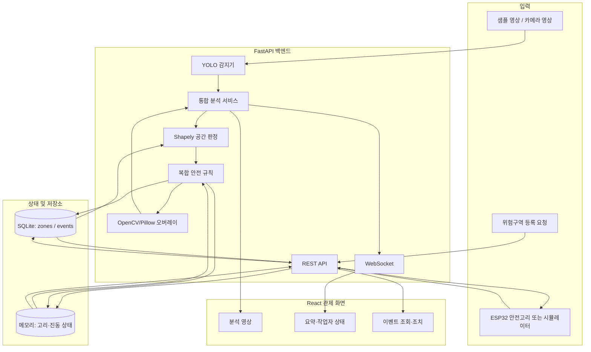
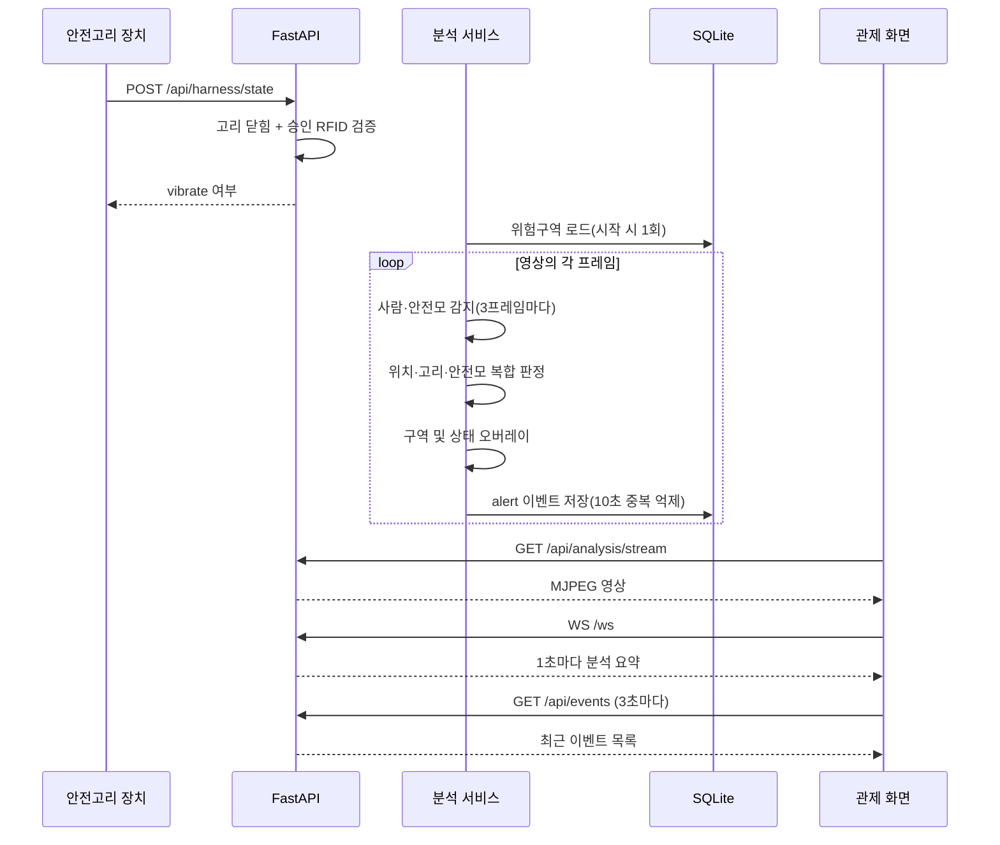

# AI 안전관리 플랫폼 프로젝트 개요

## 1. 프로젝트 정의

AI 안전관리 플랫폼은 건설·산업 현장의 영상과 작업자 안전고리 장치 데이터를 함께 분석하여 위험 상황을 조기에 식별하고, 관제 담당자와 작업자에게 즉시 전달하기 위한 실시간 안전 관제 프로토타입이다.

일반적인 영상 감지는 “사람 또는 보호구가 보이는가”에 집중한다. 이 프로젝트는 감지 결과에 작업자의 위치, 위험구역의 종류, 안전고리의 실제 체결 상태를 결합해 현장 맥락에 맞는 안전 수준을 판단하는 것을 목표로 한다.

### 해결하려는 문제

- 여러 CCTV 화면을 사람이 계속 확인해야 하는 관제 부담
- 안전모 착용, 위험구역 진입, 추락방지 고리 체결 상태의 분리된 관리
- 위험 행동 발견과 작업자 경고 사이의 시간 지연
- 안전 이벤트의 기록 및 사후 조치 이력 부족

### 핵심 가치

1. **통합 판단**: 영상, 공간, 장치 상태를 하나의 규칙으로 평가한다.
2. **즉시 전달**: 영상 오버레이, 관제 화면, 장치 진동으로 위험을 알린다.
3. **이력 관리**: 긴급 이벤트를 데이터베이스에 저장하고 조치 상태를 관리한다.
4. **현장 확장성 검증**: 실제 장치 도입 전에 영상과 시뮬레이터로 전체 흐름을 검증한다.

## 2. 현재 구현 범위

현재 저장소는 단일 FastAPI 프로세스 안에서 샘플 영상을 반복 분석하고, React 관제 화면과 안전고리 시뮬레이터를 연결하는 로컬 데모를 구현한다.

| 구분 | 현재 제공 기능 |
|---|---|
| 영상 분석 | YOLO 기반 사람·안전모 감지, 3프레임마다 추론 |
| 공간 분석 | 작업자 발 좌표와 위험구역 폴리곤의 내부·접근·외부 판정 |
| 장치 연동 | 고리 개폐 및 RFID 태그 수신, 승인 태그 검증, 진동 명령 반환 |
| 안전 판정 | 구역·안전모·고리 상태를 조합한 `ok` / `warn` / `alert` 분류 |
| 관제 | MJPEG 분석 영상, WebSocket 요약, 작업자 상태, 이벤트 목록 표시 |
| 이력 관리 | 긴급 이벤트 SQLite 저장, 조회, 통계, 조치 완료 처리 |
| 데모 지원 | 통합 PowerShell 실행 스크립트, 장치 시뮬레이터, 오프라인 분석 스크립트 |

이 문서의 설명은 계획이 아니라 현재 소스 코드의 실제 동작을 기준으로 한다. 향후 확장 항목은 마지막 절에서 별도로 구분한다.

## 3. 사용자와 대표 시나리오

### 관제 담당자

- 현재 영상과 AI 분석 상태를 한 화면에서 확인한다.
- 감지된 작업자의 안전모, 안전고리, 위험구역 상태를 확인한다.
- 발생한 안전 이벤트를 검토하고 조치 완료로 표시한다.

### 현장 작업자

- 승인된 RFID 체결 지점에 안전고리를 연결한다.
- 위험 상태가 감지되면 장치의 진동 경고를 받는다.

### 현장 관리자·시스템 운영자

- 위험구역의 이름, 유형, 영상 내 폴리곤 좌표를 등록한다.
- 분석 영상과 모델, API 및 장치 연결 상태를 점검한다.

### 전체 데모 시나리오

1. 운영자가 분석 기능과 함께 백엔드를 시작한다.
2. 분석 서비스가 YOLO 모델, 등록된 위험구역, 샘플 영상을 로드한다.
3. 장치 또는 시뮬레이터가 안전고리와 RFID 상태를 1초 간격으로 전송한다.
4. 시스템이 사람과 안전모를 감지하고 작업자의 발 위치를 위험구역과 비교한다.
5. 규칙 엔진이 작업자별 안전 수준과 사유를 결정한다.
6. 관제 화면이 분석 영상, 작업자 상태, 누적 이벤트를 표시한다.
7. 경고가 필요한 경우 안전고리 API 응답의 `vibrate` 값이 `true`가 된다.
8. `alert` 이벤트는 SQLite에 저장되고 관제 담당자가 조치 완료 처리한다.

## 4. 시스템 아키텍처

### 구성 요소별 책임

| 구성 요소 | 책임 | 주요 파일 |
|---|---|---|
| React 관제 화면 | 실시간 영상·지표·작업자·이벤트 표시 및 조치 처리 | `frontend/src/App.jsx` |
| FastAPI 앱 | 수명주기, CORS, REST 라우터, WebSocket 구성 | `backend/app/main.py` |
| 통합 분석 서비스 | 분석 스레드 실행, 프레임 공유, 상태 요약, 이벤트 저장 | `backend/app/services/analysis_service.py` |
| 객체 감지기 | 안전모 모델과 COCO 사람 모델 추론 | `backend/app/services/detector.py` |
| 분석 파이프라인 | 감지·구역·고리 결과 결합 및 작업자 상태 생성 | `backend/app/services/pipeline.py` |
| 안전 규칙 | 위치와 보호구 상태에 따른 경고 수준 결정 | `backend/app/services/safety_rules.py` |
| 영상 오버레이 | 구역, 바운딩 박스, 한글 상태 표시 | `backend/app/services/overlay.py` |
| 장치 상태 저장소 | 최근 고리·RFID 상태와 유효시간 관리 | `backend/app/services/harness_store.py` |
| 데이터 계층 | SQLite 연결 및 `Zone`, `Event` 모델 관리 | `backend/app/database.py`, `backend/app/models.py` |

## 5. 실시간 분석 데이터 흐름

### 좌표와 구역 판정

작업자의 바운딩 박스 아래쪽 중앙을 발 위치로 사용한다. 해당 좌표를 프레임 너비와 높이로 나누어 `0.0~1.0` 범위로 정규화한 뒤, 동일한 좌표계로 저장된 위험구역 폴리곤과 비교한다.

- `inside`: 발 좌표가 폴리곤 내부에 있음
- `near`: 외부에 있지만 폴리곤과의 거리가 `0.08` 미만임
- `outside`: 어떤 구역의 내부 또는 접근 범위에도 속하지 않음

여러 구역이 겹치면 등록 목록에서 먼저 확인되는 내부 구역이 우선하며, 내부 구역이 없을 때 첫 접근 구역을 사용한다.

### 감지와 표시

- 안전모·머리 감지: `backend/weights/best.pt`
- 사람 감지: `backend/yolov8n.pt`의 COCO person 클래스
- 감지 신뢰도 기준: `0.4`
- 추론 주기: 3프레임당 1회, 중간 프레임은 직전 감지 결과 재사용
- 안전모 매칭: 안전모 중심이 사람 박스 상단 1/3 안에 있으면 착용으로 판단
- 영상 전송: 최신 프레임을 JPEG 품질 82로 인코딩한 MJPEG 스트림

## 6. 안전 판정 정책

지원하는 위험구역 유형은 세 가지다.

| 코드 | 표시 이름 | 핵심 조건 |
|---|---|---|
| `no_entry` | 출입금지 | 내부 진입 즉시 긴급 |
| `fall_risk` | 추락위험 | 내부·접근 시 안전고리 체결 여부 확인 |
| `heavy_equip` | 중장비 | 내부 또는 접근 시 중장비 작업반경 경고 |

현재 규칙 엔진의 판정은 다음과 같다.

| 위치 및 조건 | 판정 | 사유 |
|---|---|---|
| 모든 구역 밖 | `ok` | 없음 |
| 출입금지 구역 내부 | `alert` | 출입금지구역 침입 |
| 구역 내부 + 안전모 미착용 | `alert` | 안전모 미착용 |
| 구역 접근 + 안전모 미착용 | `warn` | 안전모 미착용 |
| 추락위험 구역 내부 + 고리 미체결 | `alert` | 안전고리 미체결 |
| 추락위험 구역 접근 + 고리 미체결 | `warn` | 안전고리 미체결 |
| 중장비 구역 내부 또는 접근 | 최소 `warn` | 중장비 작업반경 접근 |

여러 조건이 동시에 충족되면 사유를 결합하고 더 높은 경고 수준을 유지한다. `warn` 또는 `alert` 작업자가 한 명이라도 있으면 `worker-1` 장치를 진동 대상으로 등록한다. 다만 현재 구현은 일반구역(`outside`)에서 안전모가 없어도 즉시 `ok`를 반환하므로, 보호구 검사는 위험구역 내부 또는 접근 상황에 한정된다.

## 7. 이벤트와 상태 관리

### 데이터베이스

SQLite 파일은 백엔드를 `backend` 폴더에서 실행할 때 `backend/safety.db`를 사용한다.

#### Zone

| 필드 | 의미 |
|---|---|
| `id` | 구역 식별자 |
| `name` | 관제용 구역 이름 |
| `zone_type` | `no_entry`, `fall_risk`, `heavy_equip` 중 하나 |
| `polygon` | 정규화 좌표 배열을 JSON 문자열로 저장 |

#### Event

| 필드 | 의미 |
|---|---|
| `id` | 이벤트 식별자 |
| `timestamp` | 발생 시각 |
| `event_type` | 판정 사유를 `+`로 결합한 문자열 |
| `zone_id` | 관련 구역 ID, 없으면 `null` |
| `snapshot_path` | 스냅샷 경로용 필드, 현재 저장하지 않음 |
| `confidence` | 사람 감지 신뢰도 |
| `resolved` | 관제 담당자의 조치 완료 여부 |

`alert` 수준만 이벤트로 저장한다. 같은 `event_type`과 `zone_id` 조합은 10초 안에 다시 저장하지 않아 영상의 연속 프레임에서 발생하는 중복을 줄인다. 오늘 위반 건수는 로컬 날짜의 자정 이후 저장된 이벤트 수다.

### 메모리 상태

안전고리 상태와 진동 대상 장치 목록은 데이터베이스가 아니라 FastAPI 프로세스 메모리에 보관한다.

- 기본 장치 ID: `worker-1`
- 승인 RFID: `A1B2C3D4`, `0F9E8D7C`
- 상태 유효시간: 마지막 수신 후 5초
- 유효시간 초과 시: `online=false`, `hook_closed=false`

프로세스를 재시작하면 이 상태는 초기화된다.

## 8. 외부 인터페이스

### REST 및 WebSocket

| 방식 | 경로 | 역할 |
|---|---|---|
| `GET` | `/health` | 서버 생존 확인 |
| `GET` | `/api/analysis/status` | 분석 실행 단계와 최신 결과 조회 |
| `GET` | `/api/analysis/stream` | 최신 분석 프레임 스트리밍 |
| `WS` | `/ws` | 1초 간격 요약 및 작업자 상태 전달 |
| `GET` | `/api/events?limit=50` | 최신 이벤트 조회 |
| `POST` | `/api/events/{id}/resolve` | 이벤트 조치 완료 처리 |
| `GET` | `/api/events/stats/summary` | 전체·유형별 이벤트 통계 |
| `GET` | `/api/zones` | 위험구역 목록 조회 |
| `POST` | `/api/zones` | 위험구역 생성 |
| `GET` | `/api/harness/state?device_id=worker-1` | 장치 상태 조회 |
| `POST` | `/api/harness/state` | 장치 상태 전송 및 진동 명령 수신 |

FastAPI가 자동 생성하는 상세 요청·응답 스키마는 실행 후 `http://localhost:8000/docs`에서 확인할 수 있다.

### WebSocket 요약 메시지

관제 화면은 다음 정보를 사용한다.

- 현재 작업 인원, 안전모 미착용 인원, 고리 미체결 인원
- 오늘 저장된 위반 이벤트 수
- 분석 실행 여부, 준비 단계, 안내 메시지, 마지막 오류
- 현재 프레임 번호와 처리 FPS
- 작업자별 ID, 보호구 상태, 구역, 경고 수준, 판정 사유
- `worker-1` 안전고리의 온라인 및 체결 상태

## 9. 관제 화면

React 화면은 브라우저가 접속한 호스트의 8000번 포트를 백엔드로 사용하므로, `localhost`뿐 아니라 같은 호스트 이름으로 접속한 환경에서도 API 주소를 구성할 수 있다.

화면은 다음 영역으로 구성된다.

1. 서버 연결·분석 단계·처리 FPS 표시
2. 현재 작업 인원, 안전모 미착용, 고리 미체결, 금일 위반 지표
3. AI 오버레이가 포함된 실시간 현장 영상
4. 감지 작업자별 보호구·구역·경고 상태 카드
5. 최근 안전 이벤트와 조치 완료 버튼

WebSocket이 끊기면 1.5초 뒤 재연결하고, 이벤트 목록은 3초마다 갱신한다.

## 10. 실행 모드

### 통합 실시간 분석

`ANALYSIS_ENABLED=1`이면 FastAPI 수명주기에서 분석 스레드를 시작한다. 기본 영상은 `data/videos/site1.mp4`이며 끝까지 재생하면 처음으로 돌아가 반복한다. `VIDEO_SOURCE` 환경 변수로 다른 입력 파일을 지정할 수 있다.

루트의 `start.ps1 -WithAnalyzer -WithHarness`는 백엔드, 프런트엔드, 장치 시뮬레이터를 각각 별도 PowerShell 창에서 실행한다.

### 오프라인 검증

- `scripts.analyze_video`: 사람·안전모 감지 결과를 `output.mp4`로 저장
- `scripts.analyze_video2`: 구역·고리·복합 판정 오버레이를 `output2.mp4`로 저장
- `scripts.harness_sim`: 키보드로 고리 및 RFID 상태를 변경하여 서버에 전송

오프라인 통합 분석 스크립트는 고리 상태를 API에서 가져오지만 이벤트를 DB에 저장하지 않고 콘솔에 출력한다. DB 이벤트 저장과 관제 화면 연동은 FastAPI 내부의 통합 분석 서비스를 사용할 때 동작한다.

## 11. 현재 제약과 운영 시 고려사항

이 구현은 핵심 아이디어와 데이터 흐름을 검증하기 위한 프로토타입이며, 다음 제약이 있다.

- 단일 영상 소스와 단일 고리 장치 `worker-1`을 기준으로 한다.
- 감지된 모든 사람에게 동일한 고리 상태를 적용한다.
- 작업자 ID가 추적 모델이 아닌 프레임별 감지 순서로 생성되어 프레임 사이의 동일 인물을 보장하지 않는다.
- 위험구역은 분석 시작 시 한 번만 로드하므로 실행 중 변경 후 재시작이 필요하다.
- 이벤트 중복 억제 키가 작업자 ID를 포함하지 않아 같은 구역의 같은 유형 이벤트가 10초 동안 묶일 수 있다.
- `snapshot_path` 필드는 있으나 이벤트 이미지 캡처는 구현되어 있지 않다.
- 인증·권한 관리와 API 입력에 대한 도메인 수준 검증이 없다.
- 분석 상태와 장치 상태는 프로세스 메모리이므로 다중 서버 인스턴스가 공유하지 못한다.
- 영상 오버레이 글꼴이 Windows의 `C:/Windows/Fonts/malgun.ttf`에 고정되어 있다.
- 로컬 개발용 CORS와 실행 설정이며 배포 구성, TLS, 모니터링, 백업 정책은 포함하지 않는다.

## 12. 발전 방향

실제 현장 적용 단계에서는 다음 순서의 확장이 적합하다.

1. 객체 추적기를 추가해 지속적인 작업자 ID를 부여하고 장치와 작업자를 매핑한다.
2. 다중 카메라·다중 장치 상태를 지원하고 공유 저장소를 도입한다.
3. 구역 변경 실시간 반영, 좌표 편집 UI, 입력값 검증을 추가한다.
4. 일반구역을 포함한 보호구 정책을 현장 규정에 맞게 분리·설정 가능하게 만든다.
5. 이벤트 스냅샷과 영상 구간을 저장하고 증적 보존 정책을 마련한다.
6. 인증, 역할 기반 권한, 감사 로그, 개인정보 보호 기능을 적용한다.
7. 실제 카메라 스트림과 ESP32 장치를 대상으로 지연시간·정확도·장애 복구를 검증한다.

## 13. 관련 문서

- 실행 및 개발 시작: 루트 `README.md`
- 안전 장치 구성: `docs/project-devices.md`
- 실행 중 API 명세: `http://localhost:8000/docs`
